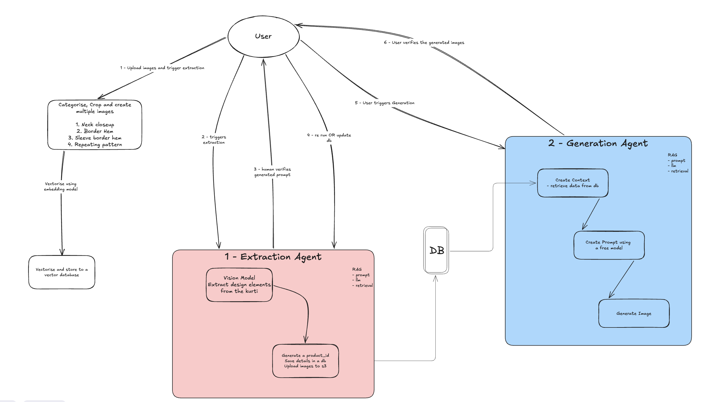

# Apparel Agent - AI-Powered Apparel Design Extraction & Generation

## Architecture Overview

The system follows a **two-stage architecture**:

1. **Design Extraction Stage**: Analyzes kurti images to extract design attributes
2. **Generation Stage**: Uses extracted attributes to generate optimized prompts and create new kurti images



*For detailed architecture flow, see the [architecture diagram](./docs/architecture_diagram.md)*


## Dependencies
**Required Python version:** 3.13+

Install the required Python packages:

```bash
pip install -r requirements.txt
```

## Workflow

### Stage 1: Design Extraction
The `VisionExtractorChain` class:
1. **Loads images** from `INPUT_FOLDER` directory
2. **Extracts attributes** using vision models (Claude 3 Haiku, GPT-4o)
3. **Stores results** in TinyDB (`vision_data.json`)
4. **Indexes summaries** in Chroma vectorstore for retrieval

**Extracted attributes include:**
- Type of garment
- Patterns
- Colors
- Sleeves
- Sleeve hem details
- Fabric type
- Neck design
- Border hem details
- Notable visual details
- Style category
- Keywords

### Stage 2: Image Generation
The `GeneratorChain` class:
1. **Retrieves context** from TinyDB (extracted attributes)
2. **Generates optimized prompts** using LLM with marketplace-specific templates
3. **Cleans prompts** by removing explanatory text
4. **Generates images** using OpenAI's image API with reference images

## How to Run

### 1. Set up Environment

Create a `.env` file in the project root:
```env
OPENAI_API_KEY=your_openai_api_key_here
OPENROUTER_API_KEY=your_openrouter_api_key_here
```

### 2. Prepare Input Images

Create an input folder inside root folder and place your reference apparel images in it.
Assign the folder name to `INPUT_FOLDER` variable in `run_agent.py`:
- `back.png`
- `neck.png` 
- `repeating_pattern.jpg`
- `front.png`
- `fabric.jpg` (optional)

### 3. Run the Complete Workflow

```bash
python run_agent.py
```

### 4. Expected Output

The script executes the following workflow:

1. **Extract Phase:**
   ```
   ------------------------
   Extracting attributes...
   ------------------------
   Attributes:
   {
     "type": "kurti",
     "patterns": "floral",
     "colors": ["red", "white"],
     ...
   }
   ------------------------
   ```

2. **Generation Phase:**
   ```
   ------------------------
   Generating kurti...
   ------------------------
   [Cleaned prompt displayed]
   Image saved to: output/{product_id}/generated_kurti.png
   ```

## Data Storage

- **TinyDB**: `vision_data.json` - Stores extracted design attributes
- **Chroma Vectorstore**: Indexes design summaries for semantic search
- **Output Images**: `output/{product_id}/` directory

## Customization

### Modify Extraction
Change vision model in `extract()` function:
```python
vision_chain = VisionExtractorChain(
    openrouter_key=os.getenv("OPENROUTER_API_KEY"),
    openrouter_model="anthropic/claude-3-haiku",  # or "openai/gpt-4o"
    tinydb_path="vision_data.json"
)
```

### Modify Generation
Change parameters in `generate()` function:
```python
result = generator_chain.invoke({
    "description": "generate a front pose of the modal in the mentioned kurti",
    "view": "front view",
    "market_place": "Meesho"  # or "Amazon", "Flipkart", etc.
})
```

### Change Input Folder
Update the `INPUT_FOLDER` variable:
```python
INPUT_FOLDER = "your_custom_folder"
```

## Troubleshooting

- **Missing images:** Ensure all required files exist in `INPUT_FOLDER`
- **API errors:** Check your API keys in `.env`
- **Pattern issues:** Verify `repeating_pattern.jpg` is clear and high-quality
- **Vision model errors:** Try different models (`claude-3-haiku`, `gpt-4o`)
- **JSON parsing errors:** Check vision model response format in logs
